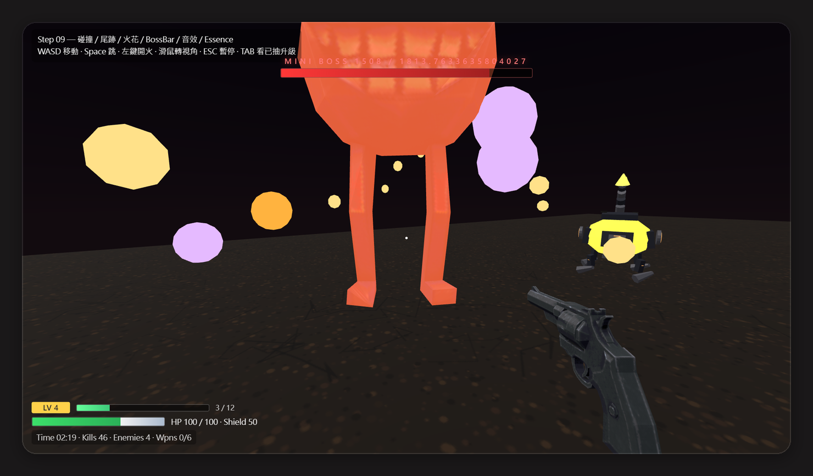
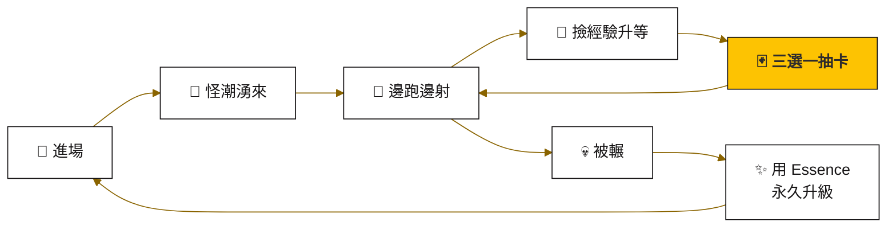
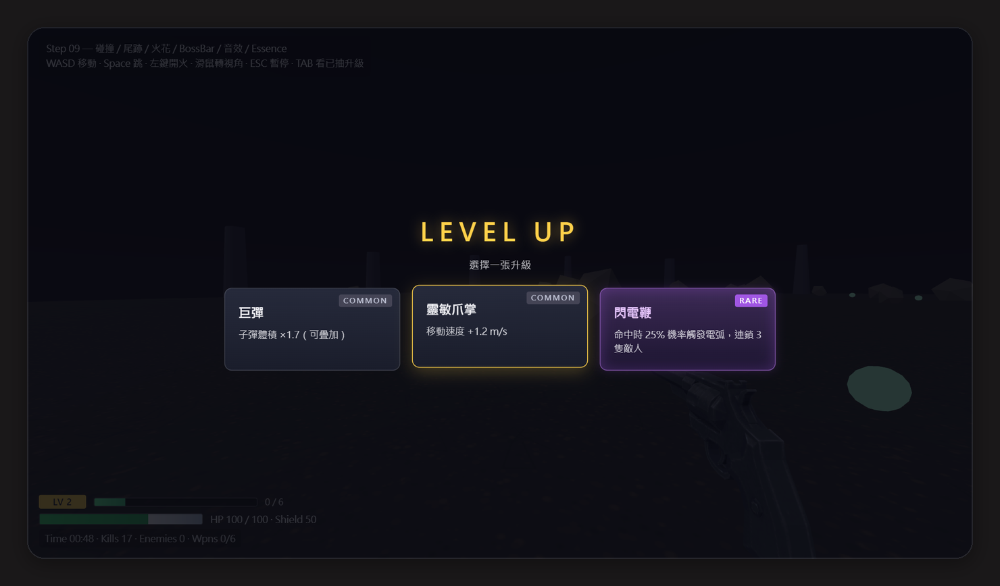
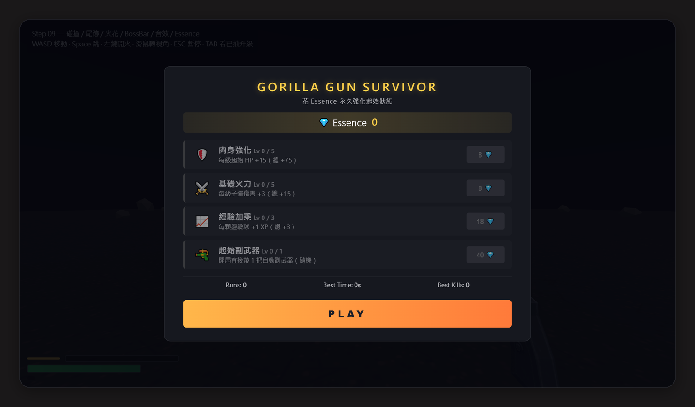
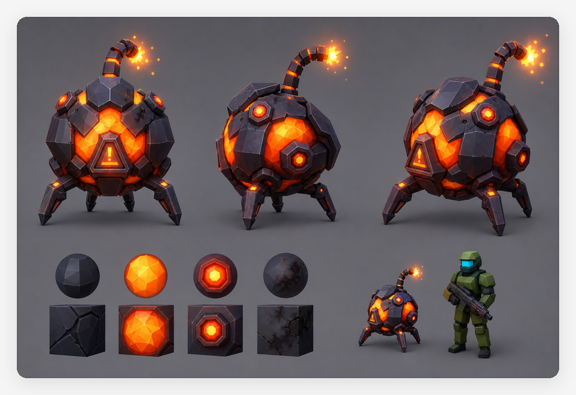
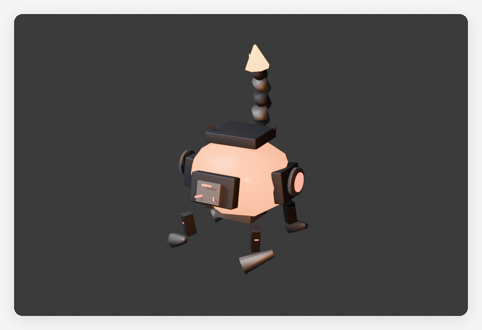

<picture>
  <source media="(prefers-color-scheme: dark)" srcset="docs/readme/banner-dark.svg">
  
</picture>

<p align="center">
  <a href="https://terry12260201.github.io/gorilla-gun-survivor/"></a>
  
  
  
</p>

<p align="center">
  <a href="#-這是什麼遊戲">遊戲介紹</a> •
  <a href="#-怎麼玩">怎麼玩</a> •
  <a href="#-這遊戲是怎麼做出來的">幕後製作</a> •
  <a href="#-自己跑起來">自己跑起來</a> •
  <a href="#-更多文件">更多文件</a>
</p>

這是一款打開瀏覽器就能玩的 3D 第一人稱生存射擊遊戲。怪物會從四面八方一直湧來，你要邊跑邊射、升級抽卡，把火力疊到離譜，撐得越久越好。

它是 Meta Quest 上 VR 遊戲《Gorilla Gun: SURVIVOR》的 PC 網頁版原型。不用安裝、不用戴頭盔，點下面的連結，十秒內就能開打。

<p align="center">
  
  <br><sub>▲ 撐到 120 秒，小 Boss 會帶著紅色警告登場，這才算「入門」</sub>
</p>

<h3 align="center"><a href="https://terry12260201.github.io/gorilla-gun-survivor/">🎮 立刻試玩 →</a></h3>

<!-- 🎬 影片位：30–60 秒實機遊玩（建議：開局 → 第一次抽卡 → 怪潮 → 120 秒小 Boss 登場）。
     上架方式：在 GitHub 網頁編輯這個 README，把 mp4 拖進編輯框（≤ 10MB），
     會產生 https://github.com/user-attachments/assets/… 網址，單獨放一行取代這段註解。 -->

---

## 🦍 這是什麼遊戲

一句話：**殺怪、撿經驗、升等抽卡、組合越來越歪、撐到 Boss、被輾、拿 Essence 永久強化、再來一局。**

類型是「Roguelike Survivor」，玩過《Vampire Survivors》或《Brotato》的人會很熟悉。差別在於這裡是第一人稱 3D，而且你是一隻用手爬行的大猩猩。

> [!NOTE]
> 這版**不是 VR**，是 PC 鍵盤滑鼠操作。世界觀、節奏和調性都沿用 [VR 版本](https://www.meta.com/zh-tw/experiences/gorilla-gun-survivor/25330246106588143/)，只是換了輸入方式。

### 一局遊戲的循環



### 它跟一般 FPS 哪裡不一樣

| | 特色 | 玩起來的感覺 |
|---|---|---|
| 🦍 | **貼地視角** | 眼睛高度不到 1.1 公尺，槍掛在前肢上，整個世界的比例都不一樣 |
| 🎯 | **雙射擊系統** | 左鍵主武器要自己瞄；副武器會自動鎖定最近的怪開火，兩邊同時跑、不互搶 |
| 🃏 | **越打越歪** | 火、冰、毒、雷四種元素，每種三階附魔；連鎖閃電一次能電 5 隻 |
| 📈 | **壓力一直升** | 沒有「一波打完喘口氣」，難度跟著時間往上爬；有怪會嗶嗶衝來自爆，有怪會在你腳邊讀秒炸開 |

<p align="center">
  
  <br><sub>▲ 每次升等三選一，紫色的是稀有卡</sub>
</p>

### 目前有多少內容

| 系統 | 數量 |
|---|---|
| 副武器 | **7 把**：手槍、衝鋒槍、狙擊、火焰噴射器、爆裂弩砲… |
| 升級卡 | **18 張**：傷害、機制、元素、武器 |
| 元素附魔 | **4 種 × 3 階** |
| 怪物 | **10 種**：含衝撞型、自爆型、小 Boss |
| 永久升級 | **4 條**，最高 14 級 |
| 音樂與音效 | 全部用 WebAudio 即時合成，**一個音檔都沒有** |

---

## 🎮 怎麼玩

| 按鍵 | 動作 |
|---|---|
| <kbd>W</kbd> <kbd>A</kbd> <kbd>S</kbd> <kbd>D</kbd> | 移動 |
| <kbd>Space</kbd> | 跳 |
| 滑鼠 | 轉視角、瞄準 |
| 左鍵 | 主武器射擊（副武器會自己打，不用管） |
| <kbd>Tab</kbd>（按住） | 看這局抽到哪些升級 |
| <kbd>Esc</kbd> | 暫停 |

> [!TIP]
> 第一次點畫面時，滑鼠會被「鎖」進遊戲裡（游標消失、轉視角不會跑出視窗），按 <kbd>Esc</kbd> 就能解開。

死掉之後會拿到 Essence，可以在開場選單買永久升級，下一局就不用從零開始：

<p align="center">
  
</p>

---

## 🧠 這遊戲是怎麼做出來的

這個原型不是一個人埋頭寫出來的，而是**我（南瓜）帶著一支 AI 虛擬遊戲團隊**做的。

我把一間遊戲工作室需要的職位，拆成 32 個 AI 角色，每個角色有自己的職責說明書。Claude 和 Codex 輪流扮演這些角色：企劃寫規格、程式照規格實作、QA 測完回報，我負責拍板方向。

| 部門 | 人數 | 例如 |
|---|---:|---|
| 👑 高層 | 4 | CEO、CTO、美術長、行銷長 |
| 🎨 美術 | 6 | 概念美術、3D、特效、UI/UX |
| 🧩 企劃 | 5 | 戰鬥、數值平衡、系統、敘事 |
| 💻 程式 | 5 | 主程式、玩法、工具、網頁前端 |
| 🔊 音效 | 3 | 音效總監、作曲、音效設計 |
| 🧪 QA | 3 | 測試、數據分析、體驗測試 |
| 📣 行銷 | 5 | 文案、社群、預告片導演 |
| 🤖 操作員 | 1 | 負責跟我對接的 Claude／Codex |

### 美術管線：從一張概念圖到遊戲裡的怪

新怪物和新武器都走同一條路：先用 GPT Image 2 生概念圖，確定外型和配色，再讓 Claude 透過 Blender MCP 照著建低面數模型，匯出 GLB 放進遊戲。

<table>
  <tr>
    <td align="center" width="50%"><br><sub>① GPT Image 2 概念圖</sub></td>
    <td align="center" width="50%"><br><sub>② Blender 建出的遊戲模型</sub></td>
  </tr>
</table>

想看完整過程（角色怎麼分工、每天怎麼自動跑、踩過哪些坑），我整理成兩篇圖文教學：

- 📖 [我如何用 Claude 跑一個虛擬遊戲開發團隊，並且開發 Roguelike 射擊網頁遊戲](https://terry12260201.github.io/gorilla-gun-survivor/studio/%E6%95%99%E5%AD%B8-%E6%88%91%E6%80%8E%E9%BA%BC%E7%94%A8Claude%E8%B7%91%E4%B8%80%E5%80%8B%E8%99%9B%E6%93%AC%E9%81%8A%E6%88%B2%E5%9C%98%E9%9A%8A.html)
- 📖 [Codex 與 Claude 虛擬遊戲團隊完整報告](https://terry12260201.github.io/gorilla-gun-survivor/studio/%E6%95%99%E5%AD%B8-Codex%E8%88%87Claude%E8%99%9B%E6%93%AC%E9%81%8A%E6%88%B2%E5%9C%98%E9%9A%8A%E5%AE%8C%E6%95%B4%E5%A0%B1%E5%91%8A.html)

---

## 🔧 自己跑起來

需要先裝 [Node.js](https://nodejs.org/) 18 以上。

```bash
git clone https://github.com/terry12260201/gorilla-gun-survivor.git
cd gorilla-gun-survivor
npm install
npm run dev
```

**做對的話**，終端機會出現 `http://127.0.0.1:5173/`，用瀏覽器打開就能玩。

<details>
<summary><b>📦 其他指令</b></summary>

| 指令 | 做什麼 |
|---|---|
| `npm run build` | 檢查武器資料、TypeScript 型別，然後打包到 `dist/` |
| `npm run preview` | 用打包好的版本在 5173 預覽 |
| `npm run convert:assets` | 把 FBX 模型轉成 glTF（`tools/convert-fbx.mjs`） |
| `npm run validate:weapons` | 單獨檢查 `src/data/weapons.json` 格式 |
| `npm run art:concept` | 用 GPT Image 2 產概念圖（需要 OpenAI API key） |
</details>

<details>
<summary><b>🚀 部署：push 到 main 就自動上線</b></summary>

push 到 `main` 分支會自動觸發 [`.github/workflows/deploy.yml`](.github/workflows/deploy.yml)，打包加部署一條龍，網址不變、直接覆蓋。

第一次部署前要做一次設定（這個 repo 已經設好了）：**Settings → Pages → Build and deployment → Source** 改成 **GitHub Actions**。

網址路徑不用手動改：workflow 會注入 `VITE_BASE` 環境變數，本機跑在 `/`、GitHub Pages 跑在 `/gorilla-gun-survivor/`，程式碼兩邊通用。
</details>

<details>
<summary><b>🧩 技術架構與資料夾</b></summary>

**Vite + TypeScript + Three.js**，全部手刻：沒用遊戲引擎、沒用物理引擎，也沒有音檔（音效都是 WebAudio 即時合成的高低頻掃頻加噪音）。

```
src/
├── core/        主迴圈、輸入、時間
├── scene/       場景、競技場、天空盒
├── player/      玩家移動與血量
├── weapon/      主武器、副武器、子彈池、元素、閃電、毒雲
├── enemy/       怪物、生怪管理、難度曲線
├── progression/ 升等、永久升級、掉落物、升級卡、經驗球
├── ui/          HUD、升級面板、暫停、Boss 血條、開場選單
├── fx/          死亡爆散、命中火花、爆炸環、鏡頭震動
└── audio/       WebAudio 音效合成
```
</details>

### 名詞對照表

| 名詞 | 白話 |
|---|---|
| Roguelike Survivor | 每局重來、死了就沒了，但能帶走一點永久成長的生存遊戲 |
| Build | 這一局抽到的升級組合，決定你怎麼打 |
| Essence | 死掉後拿到的貨幣，用來買永久升級 |
| Three.js | 讓瀏覽器能畫 3D 畫面的 JavaScript 函式庫 |
| WebAudio | 瀏覽器內建的聲音合成功能，這款遊戲用它「現場算出」所有音效 |
| GitHub Pages | GitHub 免費提供的網頁空間，試玩網址就架在這裡 |

---

## 📚 更多文件

| 文件 | 給誰看 | 內容 |
|---|---|---|
| [DESIGN.md](./DESIGN.md) | 想改遊戲的人、接手的 AI | 設計脈絡、武器／怪物／卡片完整數值、難度公式、路線圖 |
| [HANDOFF.md](./HANDOFF.md) | 接手開發 | 每次修改的紀錄 |
| [openspec/](./openspec/) | 想看 AI 團隊怎麼分工 | 32 個角色說明書、每把武器和每隻怪的規格 |
| [studio/](./studio/) | 想看製作過程 | 衝刺計畫、美術管線、團隊信箱 |

## 授權

目前未指定授權，屬於私人原型。

<sub>— 南瓜｜南瓜虛擬科技 · XR／3D／AI 工作流 · 最後更新 2026-10-02</sub>
